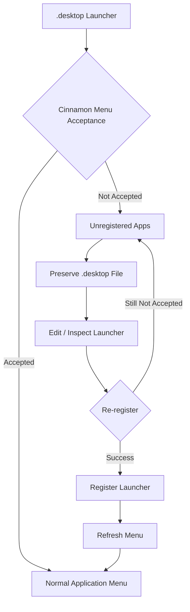

# menuet

English | [Français](README_fr.md) | [Deutsch](README_de.md) | [Italiano](README_it.md) | [Español](README_es.md) | [Português (Brasil)](README_pt-BR.md) | [日本語](README_ja.md) | [简体中文](README_zh-Hans.md) | [繁體中文](README_zh-Hant.md)

`menuet` is a specialized fork of [MenuLibre](https://github.com/bluesabre/menulibre) focused on desktop menu management and launcher recovery under **Linux Mint Cinnamon**.

Unlike the upstream project, which aims to support multiple desktop environments (DEs), `menuet` is specifically designed for the Cinnamon desktop environment and **Cinnamon Menu**. When a `.desktop` launcher is not accepted or displayed by Cinnamon Menu, `menuet` preserves the file and collects it in an **Unregistered Apps** folder at the top of the menu tree. Users can then inspect and edit the launcher before attempting to re-register it. `menuet` also provides virtual tree mapping and menu cache refresh mechanisms to help recover launchers that are not displayed correctly in Cinnamon Menu.

---

## 🎯 Target Audience & Core Use Case

Have you ever found that a `.desktop` file disappeared from Cinnamon Menu, or that a newly installed or compiled application did not appear in the menu tree?

`menuet` provides a direct way to recover launchers not accepted or displayed by Cinnamon Menu by collecting them in the **Unregistered Apps** folder while preserving their `.desktop` files. Users can inspect, edit, and re-register these launchers, providing a straightforward recovery path for applications that would otherwise be difficult to find in the application menu.

---

## 📸 Screenshot

The screenshot shows the `Unregistered Apps` folder at the top of the menu tree, where launchers not accepted or displayed by Cinnamon Menu are collected and can be re-registered.

---

## 🛠️ Features & Technical Overview

`menuet` introduces a custom tree model (`MenuetTreeWrapper`) and cache refresh routines to provide the following features:

### 1. Unregistered Apps Node
Applications whose `.desktop` files exist but are not displayed in the Cinnamon Menu are collected as **Unregistered Apps** and displayed at the top of the custom tree view.

### 2. Launcher Registration and Unregistration
The dedicated **Unregistered Apps** node allows launchers to be registered and unregistered. When registering a launcher, the required `.desktop` file is applied to the appropriate location so that it can be displayed in the Cinnamon Menu again.

### 3. Cinnamon Menu Refresh
Provides a refresh action that applies desktop changes to the Cinnamon Menu Shell.

- Executes `cinnamon --replace &` to restart the Cinnamon Menu Shell and apply the changes to the menu.

---

## 🔄 Menu Control Architecture

The following diagram illustrates how `menuet` tracks `.desktop` launchers, preserves unregistered entries, and refreshes the menu and cache state.

---

## 💻 Supported Environment

### Linux Mint Cinnamon Only

⚠️ **Linux Mint Cinnamon is the ONLY supported operating system and desktop environment.**

`menuet` relies on Cinnamon-specific menu files, libraries, and process behavior, including `cinnamon-applications.menu`.

The following setups are **explicitly unsupported**:
- Linux Mint MATE / Xfce
- Ubuntu and other distributions, even when running Cinnamon (due to differences in standard menu XML aggregation)

Compatibility with unsupported setups is not a development goal, and PRs focusing on generic desktop compliance at the cost of Cinnamon integration will be rejected.

---

## 📦 Runtime Dependencies

`menuet` relies deeply on specific packages available in the Linux Mint Cinnamon environment:

- **Python 3** & **PyGObject** (`python3-gi`)
- **GTK 3** & **GTKSourceView 3**
- **Cinnamon menu libraries** (`gir1.2-cmenu-3.0`, `gir1.2-gmenu-3.0`)
- **`xdg-utils`** (Specifically utilizing `xdg-desktop-menu` to install, uninstall, and update desktop menu entries)
- **`python3-psutil`** (For process detection and management)

Because `menuet` assumes a standard Linux Mint ecosystem, it does not package alternative fallbacks for these components.

---

## 📜 License & Credits

`menuet` is licensed under the GNU General Public License version 3 (GPL-3.0).

`menuet` is a fork of MenuLibre by bluesabre.

- **Original Project**: [MenuLibre by bluesabre](https://github.com/bluesabre/menulibre)
