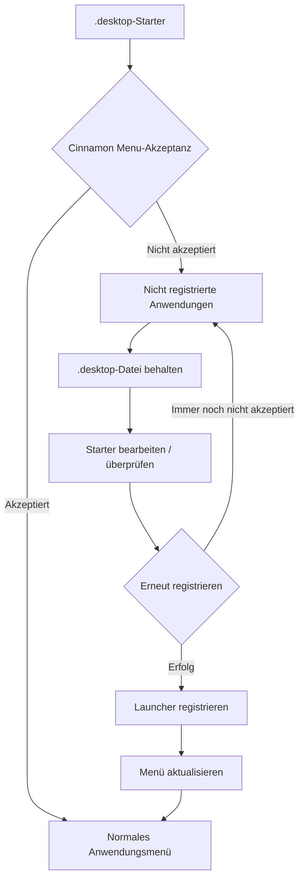

# Menuet

[English](README.md) | [Français](README_fr.md) | Deutsch | [Italiano](README_it.md) | [Español](README_es.md) | [Português (Brasil)](README_pt-BR.md) | [日本語](README_ja.md) | [简体中文](README_zh-Hans.md) | [繁體中文](README_zh-Hant.md)

`Menuet` ist ein spezialisierter Fork von [MenuLibre](https://github.com/bluesabre/menulibre), der sich auf die Desktop-Menüverwaltung und die Wiederherstellung von Anwendungsstartern unter **Linux Mint Cinnamon** konzentriert.

Im Gegensatz zum Upstream-Projekt, das darauf abzielt, mehrere Desktop-Umgebungen (DEs) zu unterstützen, wurde `Menuet` speziell für die Cinnamon-Desktop-Umgebung und das **Cinnamon Menu** entwickelt. Wenn ein `.desktop`-Starter vom Cinnamon Menu während der Validierung nicht akzeptiert oder angezeigt wird, bewahrt `Menuet` die Datei auf und sammelt sie in einem Ordner **Nicht registrierte Anwendungen** oben im Menübaum. Benutzer können den Starter dann überprüfen und bearbeiten, bevor sie versuchen, ihn erneut zu registrieren. `Menuet` bietet außerdem virtuelle Baumzuordnungen und Mechanismen zur Aktualisierung des Menü-Caches, um Starter wiederherzustellen, die im Cinnamon Menu nicht korrekt angezeigt werden.

---

## 🎯 Zielgruppe & Hauptanwendungsfall

Haben Sie schon einmal bemerkt, dass eine `.desktop`-Datei aus dem Cinnamon Menu verschwunden ist oder dass eine neu installierte oder kompilierte Anwendung nicht im Menübaum auftaucht?

`Menuet` bietet eine direkte Möglichkeit, Starter wiederherzustellen, die vom Cinnamon Menu nicht akzeptiert oder angezeigt werden, indem sie im Ordner **Nicht registrierte Anwendungen** gesammelt werden, während ihre `.desktop`-Dateien erhalten bleiben. Benutzer können diese Starter überprüfen, bearbeiten und erneut registrieren, was einen unkomplizierten Wiederherstellungspfad für Anwendungen bietet, die im Anwendungsmenü sonst schwer zu finden wären.

---

## 📸 Screenshot

Der Screenshot zeigt den Ordner `Nicht registrierte Anwendungen` oben im Menübaum, in dem vom Cinnamon Menu nicht akzeptierte Starter gesammelt werden und neu registriert werden können.

---

## 🛠️ Funktionen & technische Übersicht

`Menuet` führt ein benutzerdefiniertes Baummodell (`MenuetTreeWrapper`) und Routinen zur Aktualisierung des Caches ein, um die folgenden Funktionen bereitzustellen:

### 1. Knoten „Nicht registrierte Anwendungen“
Anwendungen, deren `.desktop`-Dateien vorhanden sind, die aber nicht im Cinnamon Menu angezeigt werden, werden als **Nicht registrierte Anwendungen** gesammelt und am oberen Rand der benutzerdefinierten Baumansicht angezeigt.

### 2. Registrierung und Aufhebung der Registrierung von Launchern
Der dedizierte Knoten **Nicht registrierte Anwendungen** ermöglicht die Registrierung und Aufhebung der Registrierung von Launchern. Bei der Registrierung eines Launchers wird die erforderliche `.desktop`-Datei am entsprechenden Speicherort abgelegt, sodass sie wieder im Cinnamon Menu angezeigt werden kann.

### 3. Aktualisierung des Cinnamon Menu
Stellt eine Aktualisierungsfunktion bereit, die Änderungen am Desktop auf die Cinnamon Menu Shell anwendet.

- Führt `cinnamon --replace &` aus, um die Cinnamon Menu Shell neu zu starten und die Änderungen auf das Menü anzuwenden.

---

## 🔄 Menü-Steuerungsarchitektur

Das folgende Diagramm veranschaulicht, wie `Menuet` `.desktop`-Starter verfolgt, nicht registrierte Einträge beibehält und den Menü- und Cache-Status aktualisiert.

---

## 💻 Unterstützte Umgebung

### Nur Linux Mint Cinnamon

⚠️ **Linux Mint Cinnamon ist die EINZIGE unterstützte Betriebssystem- und Desktop-Umgebung.**

`Menuet` basiert auf Cinnamon-spezifischen Menüdateien, Bibliotheken und dem Prozessverhalten, einschließlich `cinnamon-applications.menu`.

Die folgenden Setups werden **ausdrücklich nicht unterstützt**:
- Linux Mint MATE / Xfce
- Ubuntu und andere Distributionen, selbst wenn sie Cinnamon ausführen (aufgrund von Unterschieden in der Standard-Menü-XML-Aggregation)

Die Kompatibilität mit nicht unterstützten Setups ist kein Entwicklungsziel, und Pull-Requests (PRs), die sich auf allgemeine Desktop-Kompatibilität auf Kosten der Cinnamon-Integration konzentrieren, werden abgelehnt.

---

## 📦 Laufzeitabhängigkeiten

`Menuet` stützt sich stark auf spezifische Pakete, die in der Linux Mint Cinnamon-Umgebung verfügbar sind:

- **Python 3** & **PyGObject** (`python3-gi`)
- **GTK 3** & **GTKSourceView 3**
- **Cinnamon-Menübibliotheken** (`gir1.2-cmenu-3.0`, `gir1.2-gmenu-3.0`)
- **`xdg-utils`** (Verwendet speziell `xdg-desktop-menu` zum Installieren, Deinstallieren und Aktualisieren von Desktop-Menüeinträgen)
- **`python3-psutil`** (Für Prozesserkennung und -verwaltung)

Da `Menuet` von einem Standard-Linux Mint-Ökosystem ausgeht, sind keine alternativen Fallbacks für diese Komponenten enthalten.

---

## 📜 Lizenz & Credits

`Menuet` ist unter der GNU General Public License Version 3 (GPL-3.0) lizenziert.

`Menuet` ist ein Fork von MenuLibre von bluesabre.

- **Ursprüngliches Projekt**: [MenuLibre von bluesabre](https://github.com/bluesabre/menulibre)
