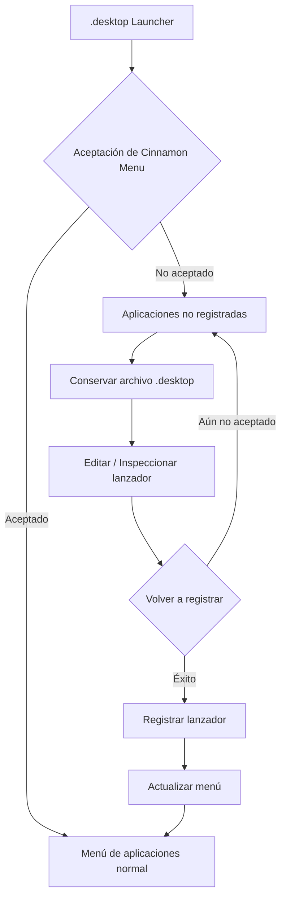

# menuet

[English](README.md) | [Français](README_fr.md) | [Deutsch](README_de.md) | [Italiano](README_it.md) | Español | [Português (Brasil)](README_pt-BR.md) | [日本語](README_ja.md) | [简体中文](README_zh-Hans.md) | [繁體中文](README_zh-Hant.md)

`menuet` es una bifurcación (fork) especializada de [MenuLibre](https://github.com/bluesabre/menulibre) centrada en la gestión de menús de escritorio y la recuperación de lanzadores bajo **Linux Mint Cinnamon**.

A diferencia del proyecto principal, cuyo objetivo es admitir múltiples entornos de escritorio (DE), `menuet` está diseñado específicamente para el entorno de escritorio Cinnamon y **Cinnamon Menu**. Cuando Cinnamon Menu no acepta o no muestra un lanzador `.desktop`, `menuet` conserva el archivo y lo recopila en una carpeta de **Aplicaciones no registradas** en la parte superior del árbol del menú. Los usuarios pueden inspeccionar y editar el lanzador antes de intentar volver a registrarlo. `menuet` también proporciona mapeo de árboles virtuales y mecanismos de actualización de la caché del menú para ayudar a recuperar los lanzadores que no se muestran correctamente en Cinnamon Menu.

---

## 🎯 Público objetivo y caso de uso principal

¿Alguna vez ha descubierto que un archivo `.desktop` desapareció de Cinnamon Menu, o que una aplicación recién instalada o compilada no aparecía en el árbol del menú?

`menuet` ofrece una forma directa de recuperar los lanzadores que Cinnamon Menu no acepta ni muestra, recogiéndolos en la carpeta **Aplicaciones no registradas** mientras conserva sus archivos `.desktop`. Los usuarios pueden inspeccionar, editar y volver a registrar estos lanzadores, lo que proporciona una ruta de recuperación sencilla para aplicaciones que de otro modo serían difíciles de encontrar en el menú de aplicaciones.

---

## 📸 Captura de pantalla

La captura de pantalla muestra la carpeta `Aplicaciones no registradas` en la parte superior del árbol del menú, donde se recopilan los lanzadores que Cinnamon Menu no acepta y desde donde se pueden volver a registrar.

---

## 🛠️ Funciones y descripción técnica

`menuet` introduce un modelo de árbol personalizado (`MenuetTreeWrapper`) y rutinas de actualización de caché para proporcionar las siguientes funciones:

### 1. Nodo de Aplicaciones no registradas
Las aplicaciones cuyos archivos `.desktop` existen pero no se muestran en el Cinnamon Menu se recopilan como **Aplicaciones no registradas** y se muestran en la parte superior de la vista de árbol personalizada.

### 2. Registro y desregistro de lanzadores
El nodo dedicado **Aplicaciones no registradas** permite registrar y desregistrar lanzadores. Al registrar un lanzador, el archivo `.desktop` necesario se aplica en la ubicación correspondiente para que pueda volver a mostrarse en el Cinnamon Menu.

### 3. Actualización del Cinnamon Menu
Proporciona una acción de actualización que aplica los cambios del escritorio al Cinnamon Menu Shell.

- Ejecuta `cinnamon --replace &` para reiniciar el Cinnamon Menu Shell y aplicar los cambios al menú.

---

## 🔄 Arquitectura de control del menú

El siguiente diagrama ilustra cómo `menuet` rastrea los lanzadores `.desktop`, conserva las entradas no registradas y actualiza el estado del menú y de la caché.

---

## 💻 Entorno compatible

### Solo Linux Mint Cinnamon

⚠️ **Linux Mint Cinnamon es el ÚNICO sistema operativo y entorno de escritorio compatible.**

`menuet` se basa en archivos de menú, bibliotecas y un comportamiento de procesos específicos de Cinnamon, incluido `cinnamon-applications.menu`.

Las siguientes configuraciones **no son compatibles explícitamente**:
- Linux Mint MATE / Xfce
- Ubuntu y otras distribuciones, incluso cuando ejecutan Cinnamon (debido a diferencias en la agregación estándar de XML de menús)

La compatibilidad con configuraciones no compatibles no es un objetivo de desarrollo, y las solicitudes de extracción (PR) que se centren en la conformidad genérica de escritorio a costa de la integración con Cinnamon serán rechazadas.

---

## 📦 Dependencias de tiempo de ejecución

`menuet` depende profundamente de paquetes específicos disponibles en el entorno de Linux Mint Cinnamon:

- **Python 3** y **PyGObject** (`python3-gi`)
- **GTK 3** y **GTKSourceView 3**
- **Bibliotecas de menús de Cinnamon** (`gir1.2-cmenu-3.0`, `gir1.2-gmenu-3.0`)
- **`xdg-utils`** (Utiliza específicamente `xdg-desktop-menu` para instalar, desinstalar y actualizar entradas de menú del escritorio)
- **`python3-psutil`** (Para la detección y gestión de procesos)

Dado que `menuet` asume un ecosistema de Linux Mint estándar, no incluye alternativas de respaldo (fallbacks) para estos componentes.

---

## 📜 Licencia y créditos

`menuet` está licenciado bajo la Licencia Pública General de GNU versión 3 (GPL-3.0).

`menuet` es una bifurcación de MenuLibre creada por bluesabre.

- **Proyecto original**: [MenuLibre por bluesabre](https://github.com/bluesabre/menulibre)
