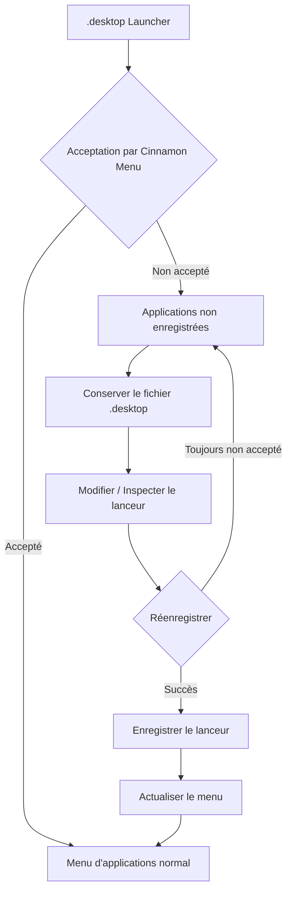

# menuet

[English](README.md) | Français | [Deutsch](README_de.md) | [Italiano](README_it.md) | [Español](README_es.md) | [Português (Brasil)](README_pt-BR.md) | [日本語](README_ja.md) | [简体中文](README_zh-Hans.md) | [繁體中文](README_zh-Hant.md)

`menuet` est un fork spécialisé de [MenuLibre](https://github.com/bluesabre/menulibre) axé sur la gestion des menus de bureau et la récupération de lanceurs sous **Linux Mint Cinnamon**.

Contrairement au projet d'origine, qui vise à prendre en charge plusieurs environnements de bureau (DE), `menuet` a été conçu spécifiquement pour l'environnement de bureau Cinnamon et **Cinnamon Menu**. Lorsqu'un lanceur `.desktop` n'est pas accepté ou affiché par Cinnamon Menu, `menuet` conserve le fichier et le regroupe dans un dossier **Applications non enregistrées** situé tout en haut de l'arborescence du menu. Les utilisateurs peuvent ensuite inspecter et modifier le lanceur avant de tenter de l'enregistrer à nouveau. `menuet` propose également des mécanismes de mappage des arborescences virtuelles et de mise à jour du cache du menu pour aider à récupérer les lanceurs qui ne s'affichent pas correctement dans Cinnamon Menu.

---

## 🎯 Public cible et cas d'utilisation principal

Avez-vous déjà remarqué qu'un fichier `.desktop` avait disparu de Cinnamon Menu, ou qu'une application récemment installée ou compilée n'apparaissait pas dans l'arborescence du menu ?

`menuet` offre un moyen direct de récupérer les lanceurs qui n'ont pas été acceptés ou affichés par Cinnamon Menu, en les regroupant dans le dossier **Applications non enregistrées** tout en préservant leurs fichiers `.desktop`. Les utilisateurs peuvent inspecter, modifier et réenregistrer ces lanceurs, ce qui constitue un chemin de récupération simple pour les applications qui seraient autrement difficiles à trouver dans le menu des applications.

---

## 📸 Capture d'écran

Cette capture d'écran montre le dossier `Applications non enregistrées` en haut de l'arborescence du menu, où les lanceurs non acceptés par Cinnamon Menu sont rassemblés et peuvent être réenregistrés.

---

## 🛠️ Fonctionnalités et aperçu technique

`menuet` introduit un modèle d’arborescence personnalisé (`MenuetTreeWrapper`) et des routines d’actualisation du cache afin de fournir les fonctionnalités suivantes :

### 1. Nœud Applications non enregistrées
Les applications dont les fichiers `.desktop` existent mais qui ne sont pas affichées dans le Cinnamon Menu sont regroupées sous **Applications non enregistrées** et affichées en haut de la vue d’arborescence personnalisée.

### 2. Enregistrement et désenregistrement des lanceurs
Le nœud dédié **Applications non enregistrées** permet d’enregistrer et de désenregistrer les lanceurs. Lors de l’enregistrement d’un lanceur, le fichier `.desktop` requis est appliqué à l’emplacement approprié afin qu’il puisse être à nouveau affiché dans le Cinnamon Menu.

### 3. Actualisation du Cinnamon Menu
Fournit une action d’actualisation qui applique les modifications du bureau au Cinnamon Menu Shell.

- Exécute `cinnamon --replace &` pour redémarrer le Cinnamon Menu Shell et appliquer les modifications au menu.

---

## 🔄 Architecture de contrôle du menu

Le diagramme suivant illustre la façon dont `menuet` suit les lanceurs `.desktop`, conserve les entrées non enregistrées et met à jour l'état du menu et du cache.

---

## 💻 Environnement pris en charge

### Linux Mint Cinnamon uniquement

⚠️ **Linux Mint Cinnamon est le SEUL système d'exploitation et environnement de bureau pris en charge.**

`menuet` s'appuie sur des fichiers de menu, des bibliothèques et un comportement de processus spécifiques à Cinnamon, notamment `cinnamon-applications.menu`.

Les configurations suivantes sont **explicitement non prises en charge** :
- Linux Mint MATE / Xfce
- Ubuntu et autres distributions, même lorsqu'elles exécutent Cinnamon (en raison de différences dans l'agrégation standard du XML des menus)

La compatibilité avec les configurations non prises en charge n'est pas un objectif de développement, et les PR se concentrant sur la conformité générique du bureau au détriment de l'intégration de Cinnamon seront rejetées.

---

## 📦 Dépendances d'exécution

`menuet` dépend profondément de paquets spécifiques disponibles dans l'environnement Linux Mint Cinnamon :

- **Python 3** & **PyGObject** (`python3-gi`)
- **GTK 3** & **GTKSourceView 3**
- **Bibliothèques de menu Cinnamon** (`gir1.2-cmenu-3.0`, `gir1.2-gmenu-3.0`)
- **`xdg-utils`** (Utilise spécifiquement `xdg-desktop-menu` pour installer, désinstaller et mettre à jour les entrées du menu du bureau)
- **`python3-psutil`** (Pour la détection et la gestion des processus)

Étant donné que `menuet` suppose un écosystème Linux Mint standard, il n'intègre pas de solutions de repli (fallbacks) alternatives pour ces composants.

---

## 📜 Licence et crédits

`menuet` est sous licence GNU General Public License version 3 (GPL-3.0).

`menuet` est un fork de MenuLibre par bluesabre.

- **Projet d'origine** : [MenuLibre par bluesabre](https://github.com/bluesabre/menulibre)