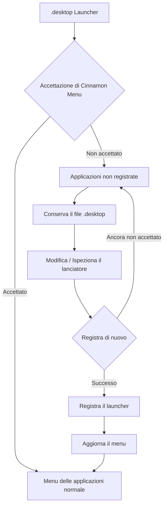

# Menuet

[English](README.md) | [Français](README_fr.md) | [Deutsch](README_de.md) | Italiano | [Español](README_es.md) | [Português (Brasil)](README_pt-BR.md) | [日本語](README_ja.md) | [简体中文](README_zh-Hans.md) | [繁體中文](README_zh-Hant.md)

`Menuet` è un fork specializzato di [MenuLibre](https://github.com/bluesabre/menulibre) incentrato sulla gestione dei menu del desktop e sul recupero dei lanciatori sotto **Linux Mint Cinnamon**.

A differenza del progetto upstream, che mira a supportare più ambienti desktop (DE), `Menuet` è progettato specificamente per l'ambiente desktop Cinnamon e **Cinnamon Menu**. Quando un lanciatore `.desktop` non viene accettato o visualizzato da Cinnamon Menu, `Menuet` conserva il file e lo raccoglie in una cartella **Applicazioni non registrate** in cima alla struttura del menu. Gli utenti possono quindi ispezionare e modificare il lanciatore prima di tentare di registrarlo nuovamente. `Menuet` fornisce anche una mappatura degli alberi virtuali e meccanismi di aggiornamento della cache del menu per aiutare a recuperare i lanciatori che non vengono visualizzati correttamente in Cinnamon Menu.

---

## 🎯 Pubblico di riferimento e caso d'uso principale

Hai mai notato che un file `.desktop` è scomparso da Cinnamon Menu, o che un'applicazione appena installata o compilata non è apparsa nella struttura del menu?

`Menuet` offre un modo diretto per recuperare i lanciatori non accettati o non visualizzati da Cinnamon Menu raccogliendoli nella cartella **Applicazioni non registrate** conservando i relativi file `.desktop`. Gli utenti possono ispezionare, modificare e registrare nuovamente questi lanciatori, fornendo un percorso di recupero semplice per le applicazioni che altrimenti sarebbero difficili da trovare nel menu delle applicazioni.

---

## 📸 Schermata

La schermata mostra la cartella `Applicazioni non registrate` in cima alla struttura del menu, dove vengono raccolti i lanciatori non accettati da Cinnamon Menu e da cui possono essere registrati nuovamente.

---

## 🛠️ Funzionalità e panoramica tecnica

`Menuet` introduce un modello ad albero personalizzato (`MenuetTreeWrapper`) e routine di aggiornamento della cache per fornire le seguenti funzionalità:

### 1. Nodo Applicazioni non registrate
Le applicazioni i cui file `.desktop` esistono ma che non vengono visualizzate nel Cinnamon Menu vengono raccolte come **Applicazioni non registrate** e visualizzate nella parte superiore della vista ad albero personalizzata.

### 2. Registrazione e deregistrazione dei launcher
Il nodo dedicato **Applicazioni non registrate** consente di registrare e deregistrare i launcher. Durante la registrazione di un launcher, il file `.desktop` richiesto viene applicato nella posizione appropriata, in modo che possa essere nuovamente visualizzato nel Cinnamon Menu.

### 3. Aggiornamento del Cinnamon Menu
Fornisce un'azione di aggiornamento che applica le modifiche al desktop al Cinnamon Menu Shell.

- Esegue `cinnamon --replace &` per riavviare il Cinnamon Menu Shell e applicare le modifiche al menu.

---

## 🔄 Architettura di controllo del menu

Il seguente diagramma illustra come `Menuet` traccia i lanciatori `.desktop`, preserva le voci non registrate e aggiorna lo stato del menu e della cache.

---

## 💻 Ambiente supportato

### Solo Linux Mint Cinnamon

⚠️ **Linux Mint Cinnamon è l'UNICO sistema operativo e ambiente desktop supportato.**

`Menuet` si basa su file di menu, librerie e comportamenti dei processi specifici di Cinnamon, incluso `cinnamon-applications.menu`.

Le seguenti configurazioni sono **esplicitamente non supportate**:
- Linux Mint MATE / Xfce
- Ubuntu e altre distribuzioni, anche se eseguono Cinnamon (a causa delle differenze nell'aggregazione XML dei menu standard)

La compatibilità con configurazioni non supportate non è un obiettivo di sviluppo e le PR incentrate sulla conformità dei desktop generici a scapito dell'integrazione di Cinnamon verranno rifiutate.

---

## 📦 Dipendenze di runtime

`Menuet` dipende fortemente da pacchetti specifici disponibili nell'ambiente Linux Mint Cinnamon:

- **Python 3** e **PyGObject** (`python3-gi`)
- **GTK 3** e **GTKSourceView 3**
- **Librerie di menu di Cinnamon** (`gir1.2-cmenu-3.0`, `gir1.2-gmenu-3.0`)
- **`xdg-utils`** (Utilizza specificamente `xdg-desktop-menu` per installare, disinstallare e aggiornare le voci del menu del desktop)
- **`python3-psutil`** (Per il rilevamento e la gestione dei processi)

Poiché `Menuet` presuppone un ecosistema Linux Mint standard, non include fallback alternativi per questi componenti.

---

## 📜 Licenza e riconoscimenti

`Menuet` è concesso in licenza con la GNU General Public License versione 3 (GPL-3.0).

`Menuet` è un fork di MenuLibre creato da bluesabre.

- **Progetto originale**: [MenuLibre di bluesabre](https://github.com/bluesabre/menulibre)
