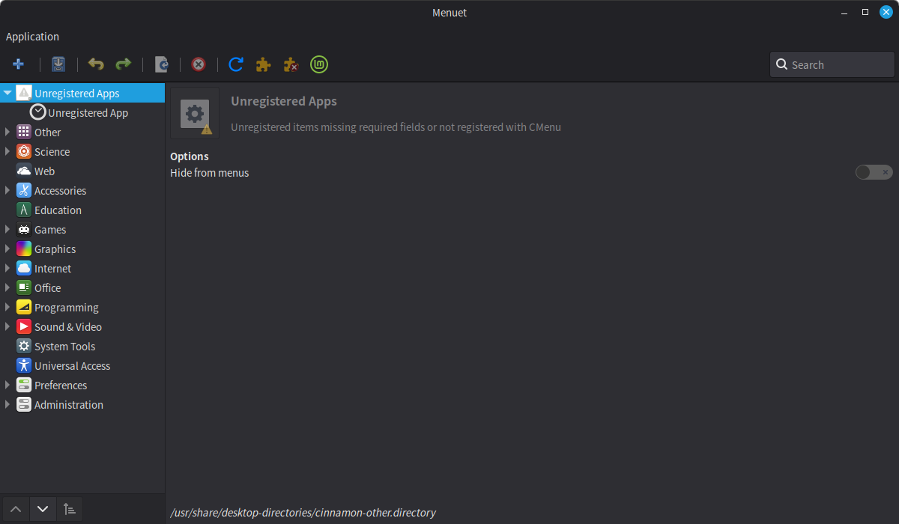
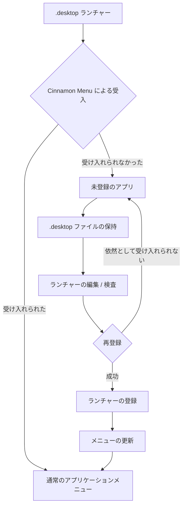

# Menuet

[English](README.md) | [Français](README_fr.md) | [Deutsch](README_de.md) | [Italiano](README_it.md) | [Español](README_es.md) | [Português (Brasil)](README_pt-BR.md) | 日本語 | [简体中文](README_zh-Hans.md) | [繁體中文](README_zh-Hant.md)

`Menuet` は、**Linux Mint Cinnamon** におけるデスクトップメニューの管理とランチャーの復元に特化した、[MenuLibre](https://github.com/bluesabre/menulibre) の専用フォークです。

複数のデスクトップ環境（DE）のサポートを目的とする上流プロジェクトとは異なり、`Menuet` は Cinnamon デスクトップ環境および **Cinnamon Menu** 専用に設計されています。Cinnamon Menu が `.desktop` ランチャーを受け入れない、または表示しない場合、`Menuet` はそのファイルを保持し、メニューツリーの最上部にある **未登録のアプリ**（未登録アプリ）フォルダーに集約します。ユーザーはランチャーを再登録しようとする前に、それらを検査・編集することができます。また、`Menuet` は仮想ツリーのマッピングとメニューキャッシュの更新機能を提供し、Cinnamon Menu で正しく表示されないランチャーの復元をサポートします。

---

## 🎯 ターゲット層と主なユースケース

Cinnamon Menu から `.desktop` ファイルが消えてしまったり、新しくインストール・コンパイルしたアプリケーションがメニューツリーに表示されなかったりした経験はありませんか？

`Menuet` は、Cinnamon Menu に受け入れられなかったり表示されなかったりするランチャーを **未登録のアプリ** フォルダーに集約しつつ、`.desktop` ファイルをそのまま保持することで、それらを直接復元する手段を提供します。ユーザーはこれらのランチャーを検査、編集、再登録できるため、アプリケーションメニュー内で見つけにくくなっていたアプリケーションを簡単に復元できます。

---

## 📸 スクリーンショット

このスクリーンショットは、メニューツリーの最上部にある `未登録のアプリ` フォルダーを示しています。Cinnamon Menu に受け入れられなかったランチャーがここに集約され、再登録を行うことができます。

---

## 🛠️ 機能と技術概要

`Menuet` は、カスタムツリーモデル（`MenuetTreeWrapper`）とキャッシュ更新ルーチンを導入し、以下の機能を実現しています。

### 1. 未登録アプリノード
`.desktop` ファイルが存在するにもかかわらず Cinnamon Menu に表示されないアプリケーションを **未登録のアプリ** として収集し、カスタムツリービューの最上部に表示します。

### 2. ランチャーの登録と登録解除
専用の **未登録のアプリ** ノードから、ランチャーの登録および登録解除を行えます。登録時には必要な `.desktop` ファイルを適切な場所へ反映し、Cinnamon Menu に再び表示できるようにします。

### 3. Cinnamon Menu の更新
Cinnamon Menu Shell のデスクトップへの変更反映を行う更新アクションを提供します。

- `cinnamon --replace &` を実行して Cinnamon Menu Shell を再起動し、メニューへの変更を反映します。

---

## 🔄 メニュー制御アーキテクチャ

以下の図は、`Menuet` が `.desktop` ランチャーを追跡し、未登録のエントリを保持し、メニューとキャッシュの状態を更新する仕組みを示しています。

---

## 💻 サポート環境

### Linux Mint Cinnamon のみ

⚠️ **Linux Mint Cinnamon は唯一サポートされているオペレーティングシステムおよびデスクトップ環境です。**

`Menuet` は、Cinnamon に厳密に紐付けられたメニューファイル、ライブラリ、およびプロセス動作（`cinnamon-applications.menu` を含む）を利用しています。

以下の環境は**明示的にサポート対象外**です。
- Linux Mint MATE / Xfce
- Ubuntu およびその他のディストリビューション（Cinnamonを実行している場合でも、標準メニューのXML集約方法の違いにより対象外となります）

サポート対象外の環境との互換性は開発目標に含まれておらず、Cinnamon との統合を犠牲にして汎用的なデスクトップ準拠を目指すプルリクエスト（PR）は拒否されます。

---

## 📦 実行時依存関係

`Menuet` は、標準の Linux Mint Cinnamon 環境にバンドルされている特定のパッケージに深く依存しています。

- **Python 3** および **PyGObject**（`python3-gi`）
- **GTK 3** および **GTKSourceView 3**
- **Cinnamon メニューライブラリ**（`gir1.2-cmenu-3.0`, `gir1.2-gmenu-3.0`）
- **`xdg-utils`**（デスクトップメニューエントリのインストール、アンインストール、更新に `xdg-desktop-menu` を使用）
- **`python3-psutil`**（プロセスの検出と管理用）

`Menuet` は標準の Linux Mint エコシステムを前提としているため、これらのコンポーネントに対する代替のフォールバックは同梱していません。

---

## 📜 ライセンスとクレジット

`Menuet` は GNU General Public License バージョン 3 (GPL-3.0) の下でライセンスされています。

`Menuet` は bluesabre 氏による MenuLibre のフォークです。

- **オリジナルプロジェクト**: [MenuLibre by bluesabre](https://github.com/bluesabre/menulibre)
