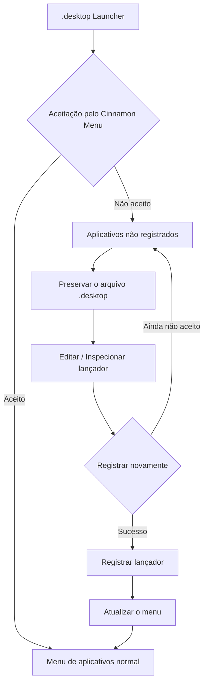

# menuet

[English](README.md) | [Français](README_fr.md) | [Deutsch](README_de.md) | [Italiano](README_it.md) | [Español](README_es.md) | Português (Brasil) | [日本語](README_ja.md) | [简体中文](README_zh-Hans.md) | [繁體中文](README_zh-Hant.md)

`menuet` é uma bifurcação (fork) especializada do [MenuLibre](https://github.com/bluesabre/menulibre) focada no gerenciamento de menus de desktop e na recuperação de lançadores (launchers) sob o **Linux Mint Cinnamon**.

Ao contrário do projeto original, que visa dar suporte a vários ambientes de desktop (DEs), o `menuet` foi projetado especificamente para o ambiente de desktop Cinnamon e o **Cinnamon Menu**. Quando um lançador `.desktop` não é aceito ou exibido pelo Cinnamon Menu, o `menuet` preserva o arquivo e o coleta em uma pasta **Aplicativos não registrados** localizada na parte superior da árvore de menus. Os usuários podem inspecionar e editar o lançador antes de tentar registrá-lo novamente. O `menuet` também fornece mapeamento de árvores virtuais e mecanismos de atualização do cache de menus para ajudar a recuperar lançadores que não são exibidos corretamente no Cinnamon Menu.

---

## 🎯 Público-alvo e caso de uso principal

Você já percebeu que um arquivo `.desktop` desapareceu do Cinnamon Menu, ou que um aplicativo recém-instalado ou compilado não apareceu na árvore de menus?

O `menuet` oferece uma maneira direta de recuperar lançadores que não foram aceitos ou exibidos pelo Cinnamon Menu, coletando-os na pasta **Aplicativos não registrados** enquanto preserva seus arquivos `.desktop`. Os usuários podem inspecionar, editar e registrar novamente esses lançadores, fornecendo um caminho de recuperação simples para aplicativos que seriam difíceis de encontrar no menu de aplicativos.

---

## 📸 Captura de tela

A captura de tela mostra a pasta `Aplicativos não registrados` na parte superior da árvore de menus, onde os lançadores não aceitos pelo Cinnamon Menu são reunidos e podem ser registrados novamente.

---

## 🛠️ Recursos e Visão Geral Técnica

`menuet` introduz um modelo de árvore personalizado (`MenuetTreeWrapper`) e rotinas de atualização de cache para fornecer os seguintes recursos:

### 1. Nó Aplicativos não registrados
Os aplicativos cujos arquivos `.desktop` existem, mas não são exibidos no Cinnamon Menu, são reunidos como **Aplicativos não registrados** e exibidos na parte superior da visualização em árvore personalizada.

### 2. Registro e cancelamento do registro de lançadores
O nó dedicado **Aplicativos não registrados** permite registrar e cancelar o registro de lançadores. Ao registrar um lançador, o arquivo `.desktop` necessário é aplicado no local apropriado para que possa ser exibido novamente no Cinnamon Menu.

### 3. Atualização do Cinnamon Menu
Fornece uma ação de atualização que aplica as alterações do desktop ao Cinnamon Menu Shell.

- Executa `cinnamon --replace &` para reiniciar o Cinnamon Menu Shell e aplicar as alterações ao menu.

---

## 🔄 Arquitetura de controle de menu

O diagrama a seguir ilustra como o `menuet` rastreia os lançadores `.desktop`, preserva as entradas não registradas e atualiza o estado do menu e do cache.

---

## 💻 Ambiente Compatível

### Apenas Linux Mint Cinnamon

⚠️ **O Linux Mint Cinnamon é o ÚNICO sistema operacional e ambiente de desktop compatível.**

O `menuet` depende de arquivos de menu, bibliotecas e comportamento de processos específicos do Cinnamon, incluindo `cinnamon-applications.menu`.

As seguintes configurações são **explicitamente incompatíveis**:
- Linux Mint MATE / Xfce
- Ubuntu e outras distribuições, mesmo quando executam o Cinnamon (devido a diferenças na agregação padrão de XML de menus)

A compatibilidade com configurações não suportadas não é um objetivo de desenvolvimento, e pull requests (PRs) focados na conformidade de desktops genéricos em detrimento da integração com o Cinnamon serão rejeitados.

---

## 📦 Dependências de Execução

O `menuet` depende fortemente de pacotes específicos disponíveis no ambiente Linux Mint Cinnamon:

- **Python 3** e **PyGObject** (`python3-gi`)
- **GTK 3** e **GTKSourceView 3**
- **Bibliotecas de menu do Cinnamon** (`gir1.2-cmenu-3.0`, `gir1.2-gmenu-3.0`)
- **`xdg-utils`** (Utiliza especificamente o `xdg-desktop-menu` para instalar, desinstalar e atualizar entradas do menu do desktop)
- **`python3-psutil`** (Para detecção e gerenciamento de processos)

Como o `menuet` assume um ecossistema Linux Mint padrão, ele não inclui alternativas de fallback para esses componentes.

---

## 📜 Licença e Créditos

O `menuet` está licenciado sob a Licença Pública Geral GNU versão 3 (GPL-3.0).

O `menuet` é um fork do MenuLibre criado por bluesabre.

- **Projeto Original**: [MenuLibre por bluesabre](https://github.com/bluesabre/menulibre)
