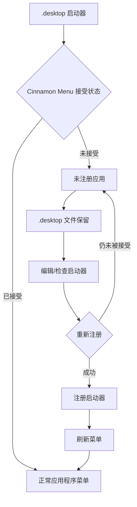

# Menuet

[English](README.md) | [Français](README_fr.md) | [Deutsch](README_de.md) | [Italiano](README_it.md) | [Español](README_es.md) | [Português (Brasil)](README_pt-BR.md) | [日本語](README_ja.md) | 简体中文 | [繁體中文](README_zh-Hant.md)

`Menuet` 是 [MenuLibre](https://github.com/bluesabre/menulibre) 的一个专用 fork，专注于在 **Linux Mint Cinnamon** 下进行桌面菜单管理和启动器恢复。

与旨在支持多个桌面环境（DE）的上游项目不同，`Menuet` 专门为 Cinnamon 桌面环境和 **Cinnamon Menu** 设计。当 `.desktop` 启动器未被 Cinnamon Menu 接受或显示时，`Menuet` 会保留该文件，并将其归入菜单树顶部的 **未注册应用** 文件夹中。随后，用户可以在尝试重新注册启动器之前对其进行检查和编辑。`Menuet` 还提供虚拟树映射和菜单缓存刷新机制，以帮助恢复在 Cinnamon Menu 中未正确显示的启动器。

---

## 🎯 目标受众与核心用例

您是否曾发现某个 `.desktop` 文件从 Cinnamon Menu 中消失了，或者新安装/编译的应用程序没有出现在菜单树中？

`Menuet` 提供了一种直接恢复未被 Cinnamon Menu 接受或显示的启动器的方法：将它们归入 **未注册应用** 文件夹中，同时保留其 `.desktop` 文件。用户可以检查、编辑并重新注册这些启动器，为那些在应用程序菜单中难以找到的应用提供了一条简便的恢复途径。

---

## 📸 截图

该截图显示了菜单树顶部的 `未注册应用` 文件夹，未被 Cinnamon Menu 接受的启动器会被归入此处并可以重新注册。

---

## 🛠️ 功能与技术概览

`Menuet` 引入了自定义树模型（`MenuetTreeWrapper`）以及缓存刷新例程，以实现以下功能：

### 1. 未注册应用 节点
`.desktop` 文件存在但未显示在 Cinnamon Menu 中的应用程序，会被收集为 **未注册应用**，并显示在自定义树视图的顶部。

### 2. 启动器注册与取消注册
专用的 **未注册应用** 节点支持对启动器进行注册和取消注册。注册启动器时，会将所需的 `.desktop` 文件写入适当的位置，使其能够再次显示在 Cinnamon Menu 中。

### 3. Cinnamon Menu 刷新
提供刷新操作，将桌面更改应用到 Cinnamon Menu Shell。

- 执行 `cinnamon --replace &` 以重新启动 Cinnamon Menu Shell，并将更改应用到菜单。

---

## 🔄 菜单控制架构

下图说明了 `Menuet` 如何跟踪 `.desktop` 启动器、保留未注册条目以及刷新菜单和缓存状态。

---

## 💻 支持的环境

### 仅限 Linux Mint Cinnamon

⚠️ **Linux Mint Cinnamon 是唯一受支持的操作系统和桌面环境。**

`Menuet` 依赖于 Cinnamon 特定的菜单文件、库和进程行为（包括 `cinnamon-applications.menu`）。

以下设置**明确不受支持**：
- Linux Mint MATE / Xfce
- Ubuntu 及其他发行版（即使正在运行 Cinnamon，由于标准菜单 XML 聚合方式的差异，也不受支持）

与不受支持的设置保持兼容并非开发目标，任何为了通用桌面合规性而牺牲 Cinnamon 集成的 Pull Request (PR) 都将被拒绝。

---

## 📦 运行时依赖项

`Menuet` 深度依赖于 Linux Mint Cinnamon 环境中可用的特定软件包：

- **Python 3** 与 **PyGObject**（`python3-gi`）
- **GTK 3** 与 **GTKSourceView 3**
- **Cinnamon 菜单库**（`gir1.2-cmenu-3.0`, `gir1.2-gmenu-3.0`）
- **`xdg-utils`**（具体使用 `xdg-desktop-menu` 来安装、卸载和更新桌面菜单项）
- **`python3-psutil`**（用于进程检测和管理）

由于 `Menuet` 假定使用标准的 Linux Mint 生态系统，因此它不会为这些组件打包替代的回退（fallback）方案。

---

## 📜 许可证与鸣谢

`Menuet` 采用 GNU 通用公共许可证第 3 版 (GPL-3.0) 授权。

`Menuet` 是 bluesabre 的 MenuLibre 的一个分支。

- **原始项目**：[MenuLibre by bluesabre](https://github.com/bluesabre/menulibre)