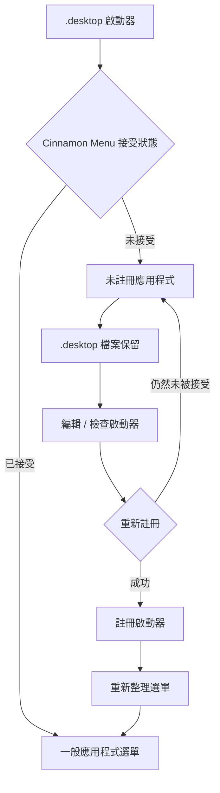

# Menuet

[English](README.md) | [Français](README_fr.md) | [Deutsch](README_de.md) | [Italiano](README_it.md) | [Español](README_es.md) | [Português (Brasil)](README_pt-BR.md) | [日本語](README_ja.md) | [简体中文](README_zh-Hans.md) | 繁體中文

`Menuet` 是 [MenuLibre](https://github.com/bluesabre/menulibre) 的一個專用 fork，專注於在 **Linux Mint Cinnamon** 下進行桌面選單管理與啟動器復原。

與旨在支援多個桌面環境（DE）的上游專案不同，`Menuet` 是專門為 Cinnamon 桌面環境和 **Cinnamon Menu** 所設計的。當 `.desktop` 啟動器未被 Cinnamon Menu 接受或顯示時，`Menuet` 會保留該檔案，並將其歸入選單樹頂部的 **未註冊應用程式** 資料夾中。隨後，使用者可以在嘗試重新註冊啟動器之前對其進行檢查和編輯。`Menuet` 也提供虛擬樹狀映射與選單快取重新整理機制，以協助復原在 Cinnamon Menu 中無法正確顯示的啟動器。

---

## 🎯 目標受眾與核心使用情境

您是否曾發現某個 `.desktop` 檔案從 Cinnamon Menu 中消失了，或者新安裝/編譯的應用程式沒有出現在選單樹中？

`Menuet` 提供了一種直接復原未被 Cinnamon Menu 接受或顯示之啟動器的方法：將它們歸入 **未註冊應用程式** 資料夾中，同時保留其 `.desktop` 檔案。使用者可以檢查、編輯並重新註冊這些啟動器，為那些在應用程式選單中難以尋找的應用程式提供了一條簡便的復原路徑。

---

## 📸 截圖

該截圖顯示了選單樹頂部的 `未註冊應用程式` 資料夾，未被 Cinnamon Menu 接受的啟動器會被歸入此處並可進行重新註冊。

---

## 🛠️ 功能與技術概覽

`Menuet` 引入了自訂樹狀模型（`MenuetTreeWrapper`）以及快取重新整理常式，以提供以下功能：

### 1. 未註冊應用程式 節點
`.desktop` 檔案存在但未顯示於 Cinnamon Menu 中的應用程式，會被收集為 **未註冊應用程式**，並顯示於自訂樹狀檢視的頂端。

### 2. 啟動器註冊與取消註冊
專用的 **未註冊應用程式** 節點可讓您註冊及取消註冊啟動器。註冊啟動器時，所需的 `.desktop` 檔案會寫入適當的位置，使其能夠再次顯示於 Cinnamon Menu 中。

### 3. Cinnamon Menu 重新整理
提供重新整理動作，將桌面變更套用至 Cinnamon Menu Shell。

- 執行 `cinnamon --replace &` 以重新啟動 Cinnamon Menu Shell，並將變更套用至選單。

---

## 🔄 選單控制架構

下圖說明了 `Menuet` 如何追蹤 `.desktop` 啟動器、保留未註冊項目，以及重新整理選單與快取狀態。

---

## 💻 支援的環境

### 僅限 Linux Mint Cinnamon

⚠️ **Linux Mint Cinnamon 是唯一受支援作業系統與桌面環境。**

`Menuet` 依賴於 Cinnamon 特定的選單檔案、函式庫與程序行為（包含 `cinnamon-applications.menu`）。

以下設定**明確不受支援**：
- Linux Mint MATE / Xfce
- Ubuntu 及其他發行版本（即使正在執行 Cinnamon，由於標準選單 XML 聚合方式的差異，亦不受支援）

與不受支援的設定保持相容並非開發目標，任何為了通用桌面相容性而犧牲 Cinnamon 整合的 Pull Request (PR) 都將遭到拒絕。

---

## 📦 執行時期相依性

`Menuet` 深度依賴於 Linux Mint Cinnamon 環境中可用的特定套件：

- **Python 3** 與 **PyGObject**（`python3-gi`）
- **GTK 3** 與 **GTKSourceView 3**
- **Cinnamon 選單函式庫**（`gir1.2-cmenu-3.0`, `gir1.2-gmenu-3.0`）
- **`xdg-utils`**（具體使用 `xdg-desktop-menu` 來安裝、解除安裝與更新桌面選單項目）
- **`python3-psutil`**（用於程序偵測與管理）

由於 `Menuet` 假設為標準的 Linux Mint 生態系統，因此它不會為這些元件打包替代的備用（fallback）方案。

---

## 📜 授權與致謝

`Menuet` 採用 GNU 通用公共授權條款第三版 (GPL-3.0) 進行授權。

`Menuet` 是 bluesabre 的 MenuLibre 的一個分支。

- **原始專案**：[MenuLibre by bluesabre](https://github.com/bluesabre/menulibre)